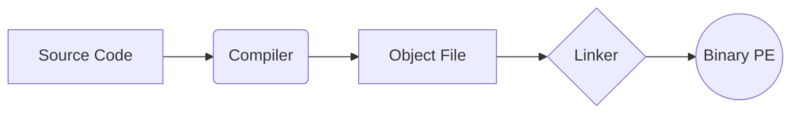
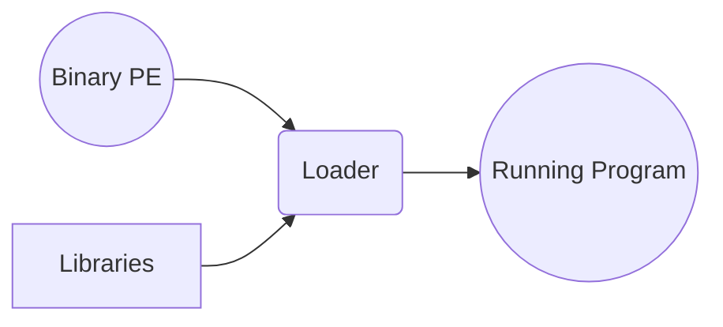

## Windows Malware Functions Overview

### Hungarian Notation

| Type/Prefix       | Description                                                                                                                                                                         |
|:------------------|:------------------------------------------------------------------------------------------------------------------------------------------------------------------------------------|
| WORD (w)          | 16-bit unsigned (positive integer) value                                                                                                                                            |
| DWORD (dw)        | Double-word; 32-bit unsigned value                                                                                                                                                  |
| Handles (H)       | A reference to an object, for resource allocation.  E.g.: Opening file, OS returns handle instead of memory/other resources.    Examples include: HModule, HInstance, HKey |
| Long Pointer (LP) | A direct memory address that points to a specific location in memory; A pointer to another type  E.g. LPByte is a pointer to a byte                                              |
| Callback          | A function that will be called by the Windows API  E.g. InternetSetStatusCallback passes a pointer to a function that is called when the system has an update of Internet status |

### File API (Host-based Indicators)

Some common Windows API functions used by malware to interact with files:

| Functions                       | Description/Inferences                                                                                                                                                                                                                                                                                      |
|:--------------------------------|:------------------------------------------------------------------------------------------------------------------------------------------------------------------------------------------------------------------------------------------------------------------------------------------------------------|
| CreateFile                      | Creates/opens files, pipes, streams, and I/O devices.  Could indicate file creation, modification, or data exfiltration.                                                                                                                                                                                |
| ReadFile/WriteFile              | Reads/writes to files as a stream.  Suggests data theft, file modification, or payload dropping, etc.                                                                                                                                                                                                   |
| CreateFileMapping/MapViewOfFile | Maps files to memory for direct manipulation.  Implies techniques like in-memory file modifications.   MapViewOfFile: Returns pointer to the base addr of the mapping to access the file. Allows for direct access to the file in memory   CreateFileMapping: Loads file from disk to memory |
| - (Pointer to Base Address)     | Allows direct read/write access and navigation within mapped files.  Indicates potential code injection / direct executable modifications in memory.                                                                                                                                                    |

### Windows Registry (Host-based Indicators)

Windows Registry
: The registry is a **hierarchical database** that stores configuration settings and options on Windows operating systems.

Malware often uses the Registry to store **configurations**, **persistence mechanisms**, and other information.
> The Windows Registry Editor can be found by searching for "Regedit" in the Windows search function

**Registry Organisation**
The registry is organised into:
- **Root Key/Hive**: Top-level sections of the registry. (HKEY is used to denote a root key)
- **Subkeys**: Subsections of the registry
- **Keys**: Folder-like objects that can contain other folders or key-value pairs
- **Value Entry**: Ordered pairs of name-data that are stored in keys
- **Value Data**: The data stored in a registry entry

| Root Key                   | Description/Inferences                                                                                                                                                                                               |
|:---------------------------|:---------------------------------------------------------------------------------------------------------------------------------------------------------------------------------------------------------------------|
| HKEY_CLASSES_ROOT          | Contains file associations and related data (Tells the system how to handle file types based on their extensions).   Might be hijacking file associations, shell extensions, or program behavior modifications.  |
| HKEY_CURRENT_USER (HKCU)   | Stores user-specific settings.  Suggests user preference/autorun modifications or storing user data.                                                                                                             |
| HKEY_LOCAL_MACHINE (HKLM)  | Stores global local machine settings.  Indicates persistence, system modifications, or privilege escalation attempts.  E.g.:`HKLM\SOFTWARE\Microsoft\Windows\CurrentVersion\Explorer\Shell Folders`          |
| HKEY_USERS                 | Contains user profile data.  Could target specific user profiles, modify default settings, or persist across user sessions.                                                                                      |
| HKEY_CURRENT_CONFIG        | Stores hardware profile settings.  Might be gathering system information or modifying hardware configurations.                                                                                                   |

**Common Registry Functions**

Some common registry functions used by malware (_* indicates that the function is given in the slides. The rest are extra and good to know!_):

| Functions          | Description/Inferences                                                                                                                                                       |
|:-------------------|:-----------------------------------------------------------------------------------------------------------------------------------------------------------------------------|
| RegOpenKeyEx*      | Opens a key in the registry for querying/editing.  Indicates registry key access, modification, or enumeration.                                                          |
| RegSetValueEx*     | Adds new value to the registry and sets its data  Implies registry value modification, persistence, or configuration changes.                                            |
| RegGetValue*       | Retrieves the type and data for the specified value entry (opened registry key).  Suggests reading registry values for configuration, persistence, or data exfiltration. |
| RegCreateKeyEx     | Creates a new key or opens an existing key.  Could indicate new registry key creation, persistence, or configuration changes.                                            |
| RegDeleteKey       | Deletes a subkey and its values.  Might be used to remove traces, configurations, or persistence mechanisms.                                                             |

> A way to detect registry modifications is taking a snapshot before and after executing a program using tools like RegShot. Compare the snapshots to identify changes. This will be talked about more in dynamic analysis.
{: .prompt-info }

Note: Refer to the [Appendix](#appendix) for a non-exhaustive list of common registry keys targetted by malware.

### Networking API (Network-based Indicators)

Socket
: An endpoint for communication between two machines over a network. Programs use sockets to send and receive data.

**Common Socket API Functions**

| Function  | Description/Inferences                                                                                         |
|:----------|:---------------------------------------------------------------------------------------------------------------|
| socket    | Creates a socket.   Might be establishing network communication capabilities.                              |
| bind      | Attaches socket to a port. Could be setting up a listening port for receiving commands/data.               |
| listen    | Prepares socket for incoming connections. Might be waiting for connections from Command & Control server.  |
| accept    | Opens and accepts incoming connection. Could be accepting connections from attackers/infected systems.     |
| connect   | Opens connection to remote socket.  Might be connecting to Command & Control server.                       |
| recv      | Receives data from remote socket. Could be receiving data/commands from remote server.                     |
| send      | Sends data to remote socket. Might be sending stolen data or system details to remote server.              |

Sniffing
: The act of capturing network traffic. Malware can use sniffing to steal sensitive information or hide its communication.

**Common Sniffing Functions**

| Function                   | Description/Inferences                                                                                                                                                                                                                                    |
|:---------------------------|:----------------------------------------------------------------------------------------------------------------------------------------------------------------------------------------------------------------------------------------------------------|
| WSASocket() / socket()     | Creates a raw socket (allows application to interact directly with network packets at the IP level instead of TCP/UDP).  Might be used for sniffing when combined with other suspicious functions.                                                    |
| bind()                     | Binds socket to a specific port.  Could be setting up a listening port for sniffing or network communication.                                                                                                                                         |
| WSAloctl() / ioctlsocket() | Puts NIC into promiscuous mode  -> NIC captures, and sends to the host's CPU, all frames/packets passing through the network, whether or not it is addressed to that specific NIC Indicates intent to sniff network traffic.                      |

### WinINET API (Network-based Indicators)

WinINET API
: A Windows API that implements high-level protocols (HTTP/FTP, etc.).

Downloaders
: Malware that downloads additional payloads from the internet. They often use WinINET functions to download the files.

> Malware might need to download additional payloads due to resource limitations (E.g. phishing emails with small payloads), or to evade detection (Initial malware sample has a smaller footprint, appearing less suspicious, evading static analysis/AV detection).
{: .prompt-info }

**Common WinINET (/Downloader) Functions**

| Function                   | Description/Inferences                                                                                           |
|:---------------------------|:-----------------------------------------------------------------------------------------------------------------|
| InternetOpen               | Initialises a connection to the internet.  Might be setting up a connection to download additional payloads. |
| InternetOpenUrl            | Opens a URL on the internet.                                                                                     |
| InternetReadFile           | Reads data from a URL.                                                                                           |
| URLDownloadToFile          | Downloads a file from a URL.  Indicates downloading files from the internet.                                 |
| ShellExecute() / WinExec() | Executes a program.  Could be executing downloaded payloads.                                                 |

### Process Manipulation (Host-based Indicators)

Process Manipulation
: - Malware often manipulates processes to **evade detection** (from firewall/user) by creating new child processes (more info below).
  - `CreateProcess` is a common function used to create new processes. It takes in the parameter `STARTUPINFO`, which includes a handle to standard input, output and error messages. 
  - A malware can create a new process with the I/O handles bound to a socket through the attacker's machine, effectively providing a remote shell.

Parent-Child Process
: - Malware can create a new process that is a child of the malware process to execute malicious activities.
: - An example from [this site](https://study-harder.qinguan.me/np/ict/matt/2-windows-malware/#downloaders):
      - A malware (disguised as Minecraft) is downloaded onto the victim's computer
      - While the "application" (also known as the parent process) runs, background processes (also known as child process) are also created
      - These background processes can be malicious and could be deleting the victim data 

> Many security solutions monitor the behaviour of the parent process / existing processes only. By creating a child process, the malware can evade detection.
{: .prompt-info }

Mutex
: - A synchronisation object that allows multiple program threads to share the same resource, such as file access.
  - Malware can use mutexes to ensure that only one instance of the malware runs on the system at a time.

### Key Loggers (Host-based Indicators)

Key Loggers
: - Malware that records keystrokes. 
  - Keyloggers can be used to spy on users or steal sensitive information like passwords.

**Methods of Key Logging**
1. **Hooking**
    - Hook: A mechanism that intercepts events, like keystrokes.
    - Hook Procedure: A function that intercepts a particular type of event. It can act on each event it receives, and modify or discard it 
    - API:
   
    | Function         | Description/Inferences                                                                                                                                                                                                  |
    |:-----------------|:------------------------------------------------------------------------------------------------------------------------------------------------------------------------------------------------------------------------|
    | SetWindowsHookEx | When called with `WH_KEYBOARD`, it installs a hook procedure to relay the event to a (malicious) function each time a key is pressed. When called with `WH_MOUSE`, it relays mouse messages (left-click/right-click) |
   
2. **Polling**
    - Loop and Poll: Continuously checking the state of each key on the keyboard within a long-running loop.
    - API:
   
    | Function         | Description/Inferences                                                  |
    |:-----------------|:------------------------------------------------------------------------|
    | GetAsyncKeyState | Retrieves the state of a specific key.  Used for polling keystrokes. |

## Basic Static Analysis Tools and Techniques
Note that this section is NOT in the same order as the slides.

### Portable Executable

Portable Executable (PE)
: A file format for executables (.exe), DLLs (.dll), and other Windows files. 
  It is a data structure that contains the information necessary for the Windows OS loader to execute the file.

**Creating a PE file**
In creating a PE file, the process is as follows:
1. Source file (`.c`)
   - Compiler translates it into object modules (`.obj`)
2. Object modules (`.obj`)
   - Linker combines various object modules into an executable (`.exe`)
3. Executable (`.exe`)
   - Loader loads the executable into memory and runs it

### Linker - Static vs Dynamic Linking

**Static Linking**
- All executable code from the library is copied into the executable
- (-) Larger (executable) file size
- (-) Difficult to differentiate between library code and program code
- (+) No dependency on external libraries

**Dynamic Linking**
- Only a reference to the library is included in the executable. Executable will search and load the library at runtime, along with the address of the functions.
- Information about the library is stored in the `.idata` section of the PE file.
- (+) Smaller (executable) file size
- (+) Easier to differentiate between library code and program code
- (-) Dependency on external libraries

### Loading a PE 

**Absolute Loading**
- Loads program into memory at the same address every time
- (-) Can cause conflicts if another program is loaded at the same address
- (+) Faster loading time

**Relocatable Loading**
- Loads program into memory at any available address
- (+) No conflicts
- (-) Requires additional processing for relocation at load time (slower execution as addresses need to be adjusted at runtime)

**Dynamic Run-time Loading**
- Loads and reloads program at different addresses during execution
- (+) No conflicts
- (+) Efficient memory management
- (-) Performance overhead due to frequent loading and unloading of code segments
- (-) Complexity in managing memory; may lead to security risks if not implemented correctly (e.g. code injection attacks)

> **Base Address** 
 The address where the program is loaded in memory.  
 **Relative Virtual Address (RVA)** 
 The address where the program runs may not be known at link time, so the PE file uses RVAs to specify the location relative to the base address of the module.  The loader will then adjust the RVAs to the actual memory address where the program is loaded.
{: .prompt-info }

### PE File Format

_Source: [ResearchGate Article](https://www.researchgate.net/publication/338355873_The_rise_of_machine_learning_for_detection_and_classification_of_malware_Research_developments_trends_and_challenges?_tp=eyJjb250ZXh0Ijp7ImZpcnN0UGFnZSI6Il9kaXJlY3QiLCJwYWdlIjoiX2RpcmVjdCJ9fQ)_

**DOS Header**
- Signature: `MZ` - `4D 5A`
- Offset to PE Header (Other fields, e.g. bytes used, file size, etc.)

**PE Header**
- Signature: `PE` - `50 45 00 00`
- Contains information about the PE file 
    - Machine type (e.g. x86, x64)
    - Number of sections
    - Timestamp (when the file was created)
    - Data directories (e.g. import/export tables, resources, etc.)

**Section Table**
- Named list of sections in the PE file

| Section Name | Description                                                                                                                                                     |
|:-------------|:----------------------------------------------------------------------------------------------------------------------------------------------------------------|
| .text        | Contains executable code                                                                                                                                        |
| .data        | Contains global data                                                                                                                                            |
| .rdata       | Contains read-only data                                                                                                                                         |
| .idata       | Contains import function information (if not present, this info is in `.rdata`)                                                                                 |
| .edata       | Contains export function information (if not present, this info is in `.rdata`.  Exported entry points are each assigned an ordinal number.)                 | 
| .rsrc        | Contains resources that the program uses (e.g. icons, bitmaps)                                                                                                  |
| .reloc       | Contains information for relocation of library files (In case preferred load address is not available for absolute loading, OR for dynamic/relocatable loading) |

### Basic Static Analysis Techniques

Here is a flowchart of the basic static analysis techniques:

View the [Practical Writeup](/posts/Practical-Basic-Static-Analysis/) for actual examples :D

## Appendix

### Common Registry Keys Targetted by Malware

Note: The `*` denotes the various root keys. For instance, `HKCU` registry keys would affect the current user, while `HKLM` would affect the local machine.

| Registry Key                                                            | Purpose                                                                                                                                                                    |
|:------------------------------------------------------------------------|:---------------------------------------------------------------------------------------------------------------------------------------------------------------------------|
| `*\Software\Microsoft\Windows\CurrentVersion\Run`                       | Persistence; Ensures that the malware runs when the user/any user logs into Windows                                                                                        |
| `*\Software\Microsoft\Windows\CurrentVersion\RunOnce`                   | Persistence/Initialisation and setup; Runs once when the/a user logs into Windows.                                                                                         |
| `*\Software\Microsoft\WindowsNT\CurrentVersion\Winlogon\Userinit`       | Persistence; Adds additional programs to the user's logon process to run                                                                                                   |  
| `HKLM\Software\Microsoft\WindowsNT\CurrentVersion\Winlogon\Shell`       | Persistence; Modification of this can change the default shell (explorer.exe) to a malicious executable                                                                    |
| `HKCU\Software\Microsoft\Windows\CurrentVersion\Explorer\Shell Folders` | Data exfiltration; Contains paths to various folders like Desktop, Start Menu, etc. Can also be used to alter the paths of special folders to capture data.                |
| `*\Software\Policies\Microsoft\Windows\System`                          | System control; Can be used to enforce system policies, disabling security features.                                                                                       |
| `*\Software\Classes\exefile\shell\open\command`                         | Execution control; Modifying this can change the default executable for opening `.exe` files, ensuring that it the malware runs first whenever any executable is launched. |
